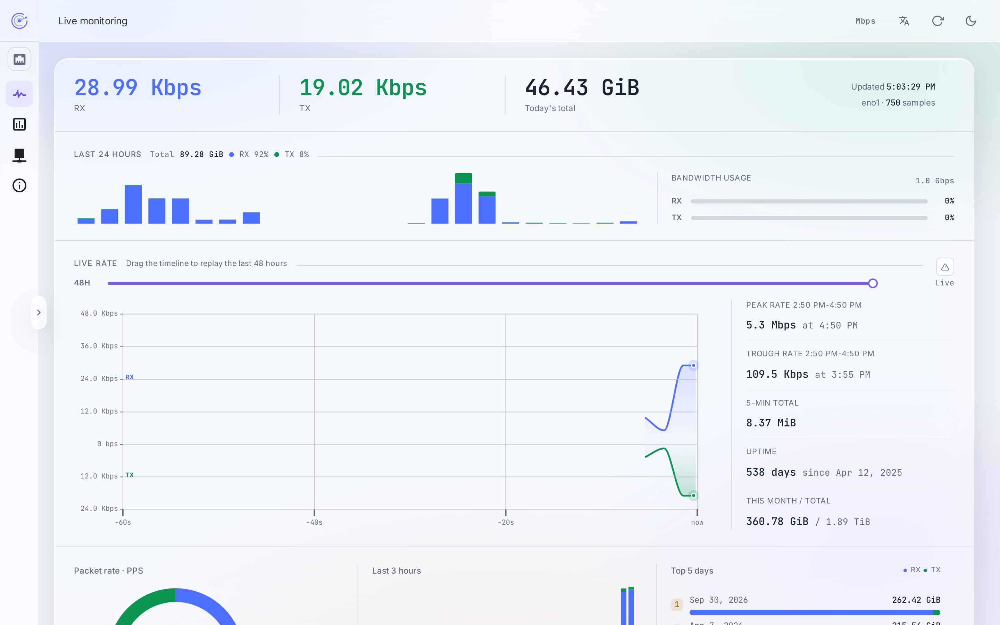
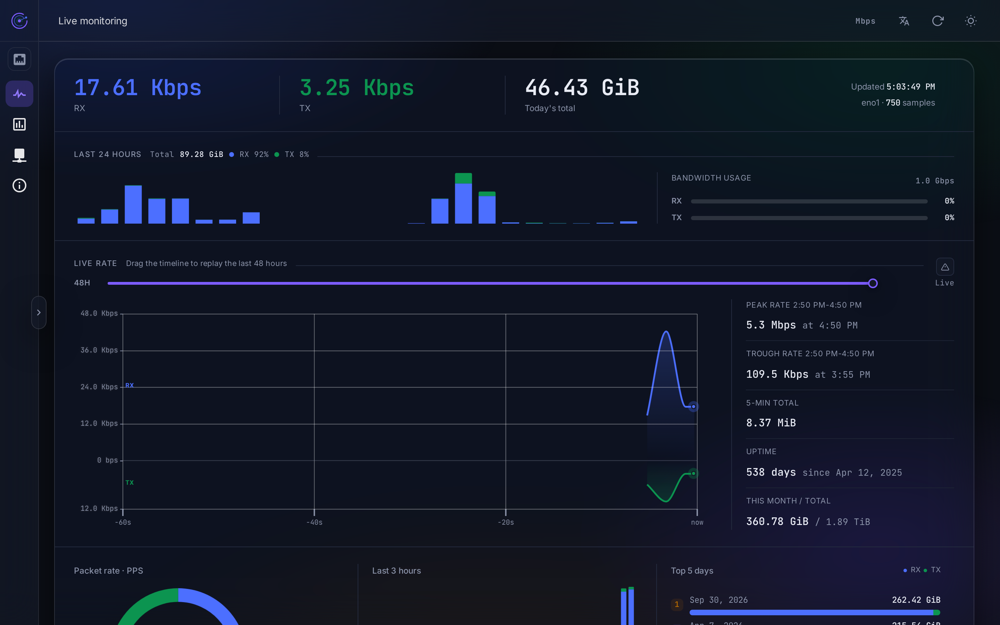
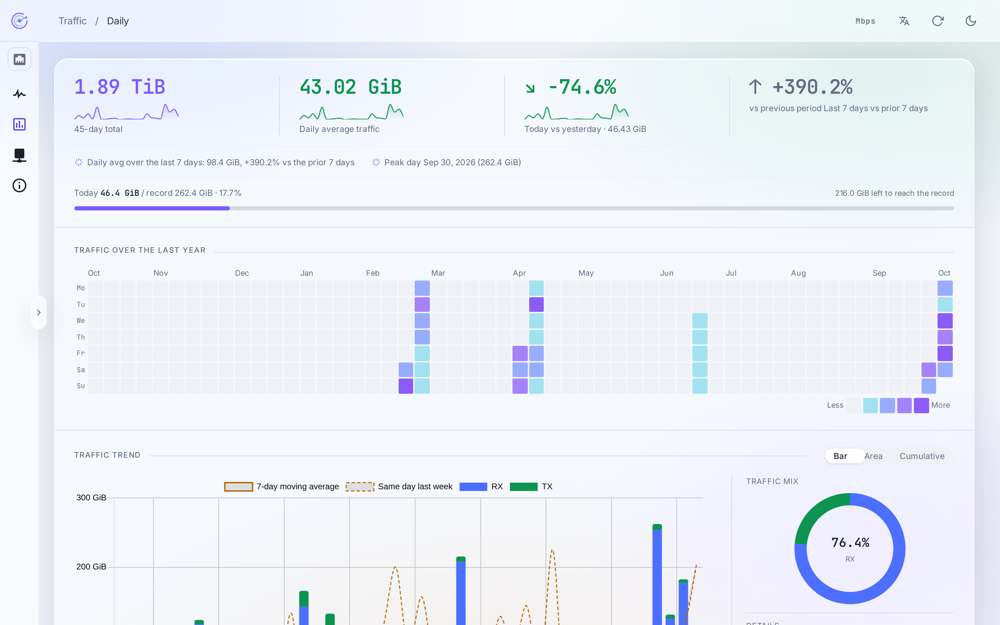
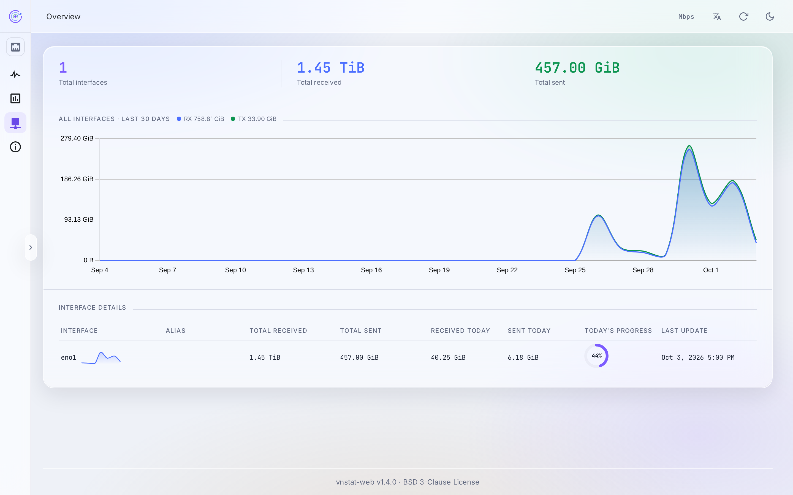
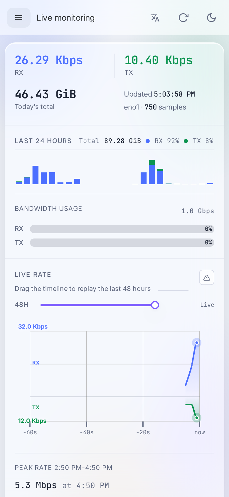

# vnStat Web

[English](README.md) | 简体中文

vnStat Web 是 vnStat 的 Web 界面，用于在浏览器中查看网络接口的实时带宽与历史流量统计。本程序为纯前端应用，构建后的文件可部署于任意静态文件服务器。

## 界面截图

**实时接口监控 — 浅色 / 深色主题**




**每日流量 — 日历热力图、趋势图与月配额**



**接口概况 — 30 日聚合趋势**



**移动端布局**



## 功能

- **实时监控**：展示各接口的实时收发速率、今日累计流量与带宽占用，可回放最近 48 小时的速率曲线
- **历史统计**：按小时、日、月、年查看流量，并附历史峰值排行
- **日历热力图**：以日历形式呈现过去一年中每日的流量分布
- **时段分布**：展示 24 小时流量分布，以及星期与小时交叉的热力图
- **月度配额**：设置月度配额后，可查看当前用量、配额进度与月末预计用量
- **接口总览**：汇总全部接口的收发流量、接口占比与近 30 日趋势
- **多语言**：界面提供简体中文、繁体中文、英语、日语、俄语、德语、西班牙语，默认跟随浏览器设置，可手动切换
- **速率单位**：速率可在比特（如 Mbps）与字节（如 MiB/s）两种单位间切换
- **深色主题**：默认跟随系统设置，可手动切换
- **移动端**：在窄屏设备上自动切换为移动端布局

## 运行条件

- 服务器已安装 vnStat，且所用版本支持 JSON 输出
- 已部署用于提供 vnStat 数据的接口服务（见「数据接口」一节）
- 从源码构建需要 Node.js 20 及以上版本、pnpm 9 及以上版本

## 部署

### 构建

```bash
pnpm install
cp .env.example .env
pnpm build
```

构建前请按下一节说明修改 `.env` 中的配置。构建产物输出至 `dist/` 目录。默认模板已可直接产出可部署的包，因为前端始终只以自身源站为基准请求 `/api/v1`。

### 配置

配置均位于 `.env` 文件。只有第一组会被编译进构建产物：

| 变量                                    | 说明                                                       | 默认值    |
| --------------------------------------- | ---------------------------------------------------------- | --------- |
| `VITE_APP_BASE_API`                     | 前端请求数据所用的路径前缀，需与数据接口的挂载路径一致     | `/api/v1` |
| `VITE_APP_MAX_POINTS`                   | 实时图表保留的数据点数                                     | `60`      |
| `VITE_APP_LINK_SPEED`                   | 链路带宽（Mbps）。当数据接口无法提供接口速率时计算带宽占用 | `1000`    |
| `VITE_APP_SSE_SHUTDOWN_RECONNECT_DELAY` | 实时数据流断开后自动重连的等待时间（毫秒）                 | `30000`   |

开发与本地预览服务器还会读取另一组变量，声明在 `.env.development` 中。前端代码从不读取它们，因此不会进入构建产物：

| 变量              | 说明                                                        | 默认值  |
| ----------------- | ----------------------------------------------------------- | ------- |
| `VITE_API_SERVER` | 数据接口的地址，仅作为开发与本地预览服务器的代理目标        | 无      |
| `VITE_APP_PROXY`  | 是否启用该代理。为 `false` 时，`VITE_API_SERVER` 被完全忽略 | `false` |

### Nginx 配置示例

前端仅从 `/api/v1` 路径读取数据。生产部署时，由静态服务器将该路径反向代理至数据接口：

```nginx
server {
    listen 80;
    root /var/www/vnstat-web;

    location /api/v1/ {
        proxy_pass http://127.0.0.1:3000;
    }
}
```

### 本地开发

```bash
pnpm dev
```

启用代理后，开发服务器会将 `/api/v1` 转发至 `VITE_API_SERVER` 指定的地址。

前端始终以自身源站为基准请求 `/api/v1`。`VITE_API_SERVER` 与 `VITE_APP_PROXY` 只作用于开发与本地预览服务器，构建产物不会内联任何机器相关的地址——这也是生产环境按上文配置反向代理的原因。

## 数据接口

vnStat Web 不包含服务端程序，须与提供 JSON 接口的 vnStat 网关配合使用。推荐使用 [vnstat-rs-api](https://github.com/CyberKoo/vnstat-rs-api)：该网关将 vnStat 的输出转换为 REST 接口，并提供实时流量的流式推送。

## 许可证

[BSD 3-Clause](LICENSE) © 2025 [CyberKoo](https://github.com/CyberKoo)

完整许可证文本见 [LICENSE](LICENSE) 文件。
